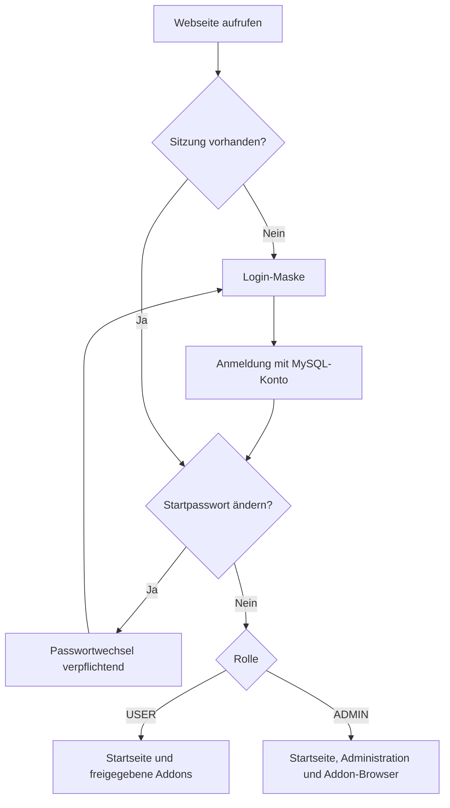

# Sibyl System – Anmeldung, Benutzerrollen und Schutz aller Seiten

**Entwicklung:** GitHub `test`; vorgesehen für Core `v0.1.0-rc.5`.

## Sichtbarkeit

Vor Anmeldung ist **nur die neutrale Login-Seite** `/login.html` samt `/login.css`, `/login.js` und CSRF-Initialisierung sichtbar. Die Startseite `/`, Adminbereich `/admin.html`, Addon-Browser `/addons.html`, deren JavaScript/CSS sowie die entsprechenden APIs verlangen eine serverseitig gültige Sitzung. Anonyme Webzugriffe auf private Seiten werden zum Login umgeleitet; anonyme private API-Anfragen geben HTTP 401 zurück. Das minimale Health-Endpoint `/actuator/health` ist für interne Serviceüberwachung ausgenommen und muss am Edge entsprechend netzwerkbeschränkt sein.

## Rollen

| Rechte | Nicht angemeldet | USER | ADMIN |
|---|---|---|---|
| Login | Ja | Ja | Ja |
| Startseite | Nein | Ja | Ja |
| Öffentliches Organisationsbranding innerhalb der Sitzung | Nein | Ja | Ja |
| Administrationsseite | Nein | Nein | Ja |
| Addon-Browser und GitHub-Releases-Katalog | Nein | Nein | Ja |
| Addon-Konfiguration und Download | Nein | Nein | Ja |
| Benutzer und weitere Administratoren erstellen | Nein | Nein | Ja |
| Eigenes Passwort ändern | Nein | Ja | Ja |

Die Regeln werden im Backend (`SecurityConfig.java`) durchgesetzt, nicht nur über CSS/JavaScript. Frühere Vorschauseiten in `/preview/**` sind gesperrt.

## Erster Start

Bei einer **leeren** MySQL-`sibyl_users`-Tabelle wird einmalig `admin` mit Startpasswort `friend`, Rolle `ADMIN` und Pflicht zum Passwortwechsel angelegt. Der Passwort-Hash wird mit BCrypt gespeichert. Der Wechsel ist vor allen normalen Seiten/API-Funktionen erforderlich; ein Neustart darf das Startpasswort **nicht** erneut setzen. Bereits vorhandene Benutzerkonten werden bei Upgrades unverändert übernommen.

Nach dem ersten Passwortwechsel legt der Administrator andere Konten im Adminbereich unter **Benutzer & Sicherheit** an: Benutzername, einmaliges Startpasswort (12–128 Zeichen) und Rolle `USER` oder `ADMIN`. Keine öffentliche Registrierung. Jedes neue Konto muss sein Startpasswort bei der ersten Anmeldung ändern. Aktuelle Phase umfasst Anlegen und Auflisten; Deaktivierung, Berechtigungsgruppen, MFA und Passwortzurücksetzung folgen getrennt.

## Sitzung und Endpunkte

Die Authentifizierung nutzt eine **serverseitige HTTP-Sitzung** mit `HttpOnly`, `Secure`, `SameSite=Lax`, Session-ID-Wechsel bei Login und 30-minütigem Idle-Timeout. Keine permanente Speicherung von Kennwörtern im Browser und keine HTTP-Basic-Authentifizierung mehr für die Benutzeroberfläche. CSRF-Schutz ist für zustandsändernde Anfragen aktiv.

Relevante Endpunkte:

- `GET /api/v1/auth/csrf` – CSRF für Login (ohne Auth).
- `POST /login` – Anmeldung mit Benutzername/Passwort (HTTPS).
- `GET /api/v1/auth/me` – eigenes Konto und Rolle.
- `POST /api/v1/auth/password` – eigenes Passwort ändern.
- `POST /logout` – Sitzung beenden.
- `GET /api/v1/admin/users` und `POST /api/v1/admin/users` – Benutzerverwaltung (ADMIN).
- `GET /api/v1/addons/catalog` und `POST /api/v1/admin/addons/{id}/download` – ausschließlich ADMIN.

**Sicherheitshinweis:** Das bekannte Bootstrap-Passwort `friend` ist nur im abgeschotteten Erstinstallationsstadium zulässig. Vor externem Einsatz muss es geändert und ein vertrauenswürdiges HTTPS-Zertifikat eingerichtet werden. Kein Login über gewöhnliches HTTP. Für Core-Upgrades gilt Rollback, aber MySQL-Migrationen müssen unabhängig backup-/restoregetestet sein.

## Verifikation

`.github/workflows/db-ci.yml` testet gegen MySQL 8:

- Anonym sieht nur Loginmaske und CSRF-Bootstrap; alle weiteren Seiten und APIs sind geschützt.
- Initialer `admin` muss vor jeder App-Nutzung das Startpasswort ändern.
- Admin kann `USER` und weitere `ADMIN` in MySQL anlegen.
- Normalbenutzer kann Startseite, aber weder Admin- noch Addon-Seiten oder deren APIs selbst über direkte URL aufrufen (HTTP 403).
- Weitere Administratoren müssen vor dem Zugriff ebenfalls ihr Startpasswort ändern.
- Logout invalidiert die Sitzung; API- und MySQL-Einstellungen bleiben geschützt.

**Lab-Deployment:** Vor der Aktivierung des Releases Nginx auf VM `.240` so konfigurieren, dass **jede HTTP-Anfrage auf HTTPS** umgeleitet wird; die alte, ungeschützte statische Vorschau darf nicht mehr ausgeliefert werden. Während der Umstellung `.241` absichern und anschließend Zugriffsrechte anonym/USER/ADMIN prüfen.
