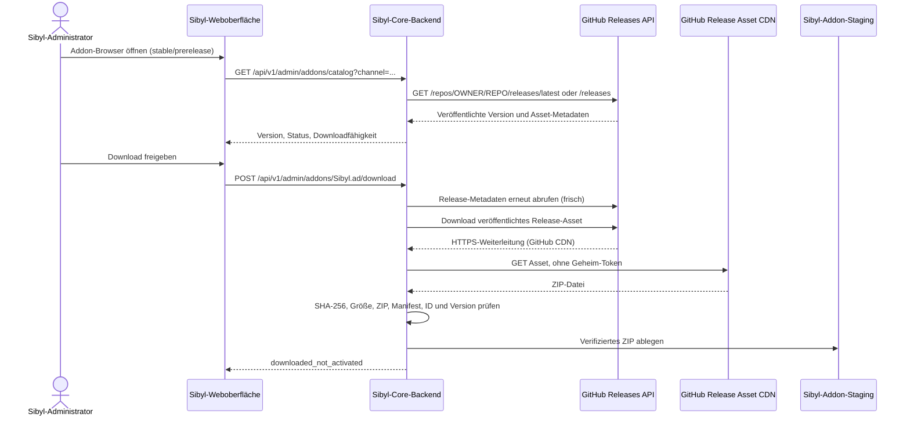

# Sibyl System – Serverbasierter GitHub-Addon-Download

**Entwicklungsstatus:** `test` · Stand 09.10.2026. Dieses Dokument beschreibt den Codepfad des künftigen Sibyl Core. Die derzeitige Webseite auf Cluster 3 ist weiterhin eine statische Vorschau; der Release-Installer ist dort noch nicht deployed.

## Ziel

Jede Organisation betreibt ihren eigenen Sibyl-Server. Bei Auswahl eines Addons führt **der Sibyl-Backendserver** die GitHub-Anfragen aus. Benutzer sollen weder Git/ZIP-Dateien manuell laden noch eigene GitHub-Zugänge benötigen, wenn das Addon öffentlich veröffentlicht wurde. GitHub stellt den Quellcode und die versionierten Release-Artefakte bereit; die jeweilige Sibyl-Installation führt das Addon lokal aus.

## Verteilung – öffentlich ohne Anmeldung

1. Jeder Addon-Anbieter verwaltet ein **eigenes GitHub-Repository** (`Sibyl.ad`, `Sibyl.inventory` usw.) mit `main` und `test`.
2. Veröffentliche einen **echten GitHub-Release** mit SemVer-Tag (`v1.0.0` für stabil, `v0.1.0-rc.1` als Pre-Release).
3. Hänge das Version-Asset im Format `Sibyl.ad-v0.1.0-rc.1.zip` an. GitHub stellt im REST-Ergebnis die Prüfsumme des Release-Assets als `digest: sha256:...` bereit.
4. Das **öffentliche Repository** und seine veröffentlichten Release-Assets sind über `https://api.github.com/repos/OWNER/REPO/releases...` für beliebige Sibyl-Server ohne Token abrufbar.
5. Im öffentlichen Modus verwendet der Core ausschließlich den validierten `browser_download_url` des **veröffentlichten** Release-Assets, prüft HTTPS und GitHub-Pfad und lädt das Paket über GitHub/CDN.
6. Der Core prüft die GitHub-Asset-Prüfsumme, Archivgrenzen, `module.json` mit erwarteter ID/Version und legt das ZIP nur in Staging ab. Ein Addon wird **nicht automatisch ausgeführt**.

**Wichtig:** Ein *privates* GitHub-Repository kann ein beliebiger externer Sibyl-Server ohne Zugangsdaten nicht abrufen. Solche Repositories benötigen entweder eine serverseitige GitHub-App-Berechtigung/ein eng begrenztes Zugriffstoken oder eine separate **öffentliche Veröffentlichung**. Es ist möglich, den Quellcode privat zu halten und nur ein öffentliches Release-Distributionsrepository bereitzustellen; die Release-Quelle muss dann explizit im geprüften Katalog hinterlegt werden.

**Aktueller Ist-Zustand 09.10.2026:** `Sibyl_System`, `Sibyl.ad`, `Sibyl.inventory`, `Sibyl.planning`, `Sibyl.doc` sind privat. `Sibyl.ad` hat noch keinen GitHub-Release (Workflows scheitern). Es wäre falsch, die auf den Buildservern erzeugten ZIPs als veröffentlichte und installierbare Addons darzustellen.

## Serverseitige Implementierung in `test`

- `backend/src/main/java/org/sibyl/core/GitHubReleaseService.java`:
  - Öffentliche GitHub-Repositories ohne Token anfragen, private optional per `SIBYL_GITHUB_TOKEN`.
  - `stable` fragt `/releases/latest` ab, `prerelease` filtert tatsächlich veröffentlichte Pre-Releases aus `/releases`.
  - Die HTTP-Anfrage geht **ausschließlich vom Backend** zu GitHub. Repository-Ziele stammen aus dem serverseitig geprüften Katalog; keine freien URLs aus Browsereingaben.
  - Metadaten fünf Minuten zwischenspeichern, um GitHub-Rate-Limits für anonyme Abrufe zu schonen; unmittelbar vor einem Download erneut live prüfen.
  - Öffentliche Assets über GitHubs `browser_download_url`, private über den Releases-Asset-API-Endpunkt. Bearer-Tokens nicht an CDN-Hosts weiterleiten.
  - Nur das genau zum Modul passende Release-ZIP auswählen, GitHub-SHA256-Digest prüfen, Datei-/Entpackgrenzen und Manifest validieren.
- `backend/src/main/java/org/sibyl/core/AddonController.java`: Katalog und geschützter Download; unterscheidet `no_release` von `repository_unavailable`.
- `frontend/addon-browser.js`: Benutzerinteraktion ausschließlich mit der Sibyl-Core-API, keine Github-Tokens, keine clientseitigen fremden ZIP-Downloads.
- `catalog/default.json`: GitHub-Allowlist als installierbarer Vertrauenskatalog.

## Sicherheit und noch offene Arbeit

- Ein Download in Staging ist **keine Installation/Aktivierung**. Sichere Runtime, Signatur-/Vertrauensprüfung, Abhängigkeitsauflösung, Migrationen, Healthcheck und Rollback sind separate Schritte.
- Der Download-Endpunkt ist als **Admin-Endpunkt** vorgesehen; er darf nicht ohne HTTPS, Authentication, Authorization und CSRF-Schutz an normale Webbesucher freigegeben werden.
- Keine Geheimnisse im JavaScript, im ZIP, im Repo oder als Web-URL. GitHub-Token nur dann, wenn ein Anbieter ausdrücklich ein privates Repo anbietet.
- GitHubs öffentliche API hat für anonyme Clients niedrigere Quotas; Metadaten werden deshalb gecacht und HTTP 403/429 sollten sichtbar werden.
- ZIP-Prüfsummen sichern Integrität des Assets, nicht automatisch die Vertrauenswürdigkeit des Herausgebers. Für Drittanbieter-Addons ist ein separater Trust-/Signaturprozess nötig.
- Die laufende Cluster-3-Weboberfläche auf `172.22.120.240` ist **noch eine statische Vorschau**. Ein Live-Abgleich oder End-to-End-Download wurde dort nicht eingerichtet. 
- Der Code wurde geändert, aber ein vollständiger Core-Maven-Build/Integrationstest steht aus, weil die geplante Build-Dateiübertragung auf VM201 von einer Remote-Sicherheitsprüfung blockiert wurde.

## Prüfung und Freigabe

Auf VM201 wurde eine **unauthentifizierte HTTPS-GitHub-API-Anfrage** an ein öffentliches Beispielrepository erfolgreich mit HTTP 200 beantwortet, inklusive Release-Digests. Dieselbe unauthentifizierte Abfrage für `FionaAleksic/Sibyl.ad` gab HTTP 404 zurück, passend zur aktuellen privaten Repository-Sichtbarkeit. Dies testet Erreichbarkeit der API, **nicht** den vollständigen Sibyl-Downloader.

Vor produktivem Freigeben sind auf `test` mindestens Maven-Build, Integrationstests, Test mit echtem öffentlichen Release-Asset, Zugriffsschutztests und die Veröffentlichung eines echten Sibyl-Core-Releases erforderlich. Installation auf Kundenservern ausschließlich aus Release-Artefakten.
