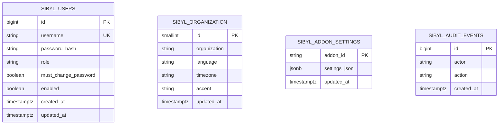

# Sibyl System – Standardinstallation mit Datenbank

**Stand:** 09.10.2026 · Sibyl Core **v0.1.0-rc.2** (in Entwicklung, erst nach erfolgreicher Veröffentlichung installierbar)

## Ziel

Bei einer neuen selbst gehosteten Sibyl-Standardinstallation wird **PostgreSQL automatisch mitinstalliert**. Der Installer erstellt eine **eigene Datenbank `sibyl` und den eingeschränkten Datenbankbenutzer `sibyl`**, erzeugt ein zufälliges 256-Bit-Datenbankpasswort und startet den Sibyl-Core-Dienst. Die Tabellen entstehen automatisch über Flyway-Migrationen. Keine bestehende AD-Installation oder sonstiger Verzeichnisdienst ist Voraussetzung.

Die Erstinstallation ist firmenneutral. Eine beliebige Organisation installiert dieselben Komponenten und passt Namen, Aussehen, Benutzer und Addons später in der Administration an.

## Systemanforderungen und Installation

Der mit dem **veröffentlichten GitHub-Core-Release** ausgelieferte `install-sibyl-ubuntu-2404.sh` ist für **eine frische, dedizierte Ubuntu-24.04-VM** ausgelegt. Er benötigt Root-Rechte, HTTPS-Zugriff auf Ubuntu-Paketquellen und die veröffentlichten GitHub-Releases von `FionaAleksic/Sibyl_System`.

1. Das Installationsscript **aus dem Release** (nicht aus einem Branch-ZIP) beziehen und dessen GitHub-Asset-Prüfsumme prüfen. Beispiel-Release: `https://github.com/FionaAleksic/Sibyl_System/releases/tag/v0.1.0-rc.2` (erst nach Veröffentlichung).
2. Das Script lokal prüfen und auf einer frischen VM mit `sudo bash install-sibyl-ubuntu-2404.sh` ausführen.
3. Der Installer installiert PostgreSQL, Java 21 und Systemwerkzeuge, erzeugt die Datenbank samt Zufallspasswort und lädt **das versionierte Core-JAR direkt aus demselben GitHub-Release**. Dessen SHA-256 wird gegen die GitHub-API geprüft.
4. `systemd` startet `sibyl-core.service`. Core verbindet sich mit PostgreSQL und Flyway erstellt alle Tabellen. Healthcheck: `curl http://127.0.0.1:8080/actuator/health` (nur lokal).
5. Bevor ein Browser administrative Endpunkte erreicht, **einen Reverse Proxy mit HTTPS-Zertifikat einer vertrauenswürdigen CA** konfigurieren. Der Standardinstaller bindet bewusst nur an `127.0.0.1:8080`.

Der Installer ist **idempotent ausgelegt**: Bei erneutem Lauf bleibt das vorhandene DB-Passwort erhalten. Flyway migriert schrittweise; die Admin-Zugangsdaten werden bei Neustarts und regulären Updates **nicht** wieder auf das Startpasswort zurückgesetzt. Vor Upgrades immer DB-Backup und Rollback planen.

## Erstes Administratorkonto

| Feld | Wert beim allerersten Start |
|---|---|
| Benutzer | `admin` |
| Einmaliges Passwort | `friend` |
| Rolle | `ADMIN` |
| Persistenz | PostgreSQL `sibyl_users` |
| Passwortspeicherung | BCrypt-Hash, niemals Klartext |
| Passwortwechsel | Zwingend vor jeder Admin-Konfiguration |
| Neues Passwort | Mindestens 12 Zeichen, ungleich `friend` |

**Sicherheitswarnung:** `friend` ist ein öffentlich bekanntes Startpasswort. Neue Installationen **niemals** ins Internet stellen und keinesfalls ohne sicheren TLS-Zugriff oder vor dem Passwortwechsel dauerhaft betreiben. Die Anwendung erlaubt mit dem Startpasswort nur das Anzeigen des eigenen Kontos, das Abrufen des CSRF-Tokens und den Passwortwechsel; Admin-Einstellungen und Addon-Downloads werden mit HTTP 423 blockiert. Nach dem Wechsel wird das alte Passwort ungültig.

## Nach der ersten Anmeldung konfigurieren

Über `/admin.html`:

- Organisation: Name, Sprache, Zeitzone, Akzentfarbe, zentral gespeichert in `sibyl_organization`.
- Addons: bekannte GitHub-Addons wählen und nicht geheime Konfigurationsfelder als JSON dauerhaft in `sibyl_addon_settings` speichern. Geheimnisse wie Serviceaccount-Passwörter oder API-Tokens dürfen **nicht** in diese JSON-Datenbankfelder eingetragen werden.
- Browser: veröffentlichte GitHub-Releases und Pre-Releases serverseitig erkennen; geschützte Downloadaktion nur für Administratoren.
- Konto: eigenes Passwort ändern (Pflicht beim ersten Login).

Die Datenbank ist für Sibyl-Benutzer, Berechtigungen und Konfigurationen maßgeblich. Eine spätere AD-Integration ist **optional** und bleibt auf interne Directory-Funktionen beschränkt. **Noch nicht umgesetzt:** Mehrbenutzeranlage, differenziertes RBAC über `ADMIN` hinaus, Plugin-Runtime/Aktivierung, vollständige Formularerzeugung aus Addon-Schemata und echte Geheimnisverwaltung. Dafür weitere Entwicklungsstufen erforderlich.

## Datenmodell



Die Migration liegt in `backend/src/main/resources/db/migration/V1__core.sql`. Neue Versionen erhalten zusätzliche nummerierte Flyway-Dateien. Die Datenbank und bestehende Benutzer niemals ungefragt zurücksetzen.

## Backups und Wartung

Verwende tägliche Sicherungen (mit Retention außerhalb der VM). Beispiel **lokal auf der Datenbank-VM** nach Aktivierung:

```bash
sudo -u postgres pg_dump -Fc -d sibyl -f /var/lib/postgresql/sibyl-backup.dump
```

Das Verzeichnis muss ausschließlich für berechtigte Administratoren lesbar sein und regelmäßig auf erfolgreiche Wiederherstellung getestet werden. Bei Ausfällen: `systemctl status postgresql sibyl-core`, `journalctl -u sibyl-core -n 100` und Flyway-Status prüfen. Niemals ein Update erzwingen, wenn Migrationen fehlgeschlagen sind.

## Separater Datenbankserver (Cluster 3)

Die bestehende Laborarchitektur nutzt **VM202 `172.22.120.242`** als Datenbank und **VM201 `172.22.120.241`** für den Core. Der Standardinstaller für *einen* Server darf dort **nicht** unüberlegt ausgeführt werden, da er PostgreSQL lokal installiert und den Core auf Loopback bindet. Für Cluster 3 muss PostgreSQL separat auf VM202 installiert, Port 5432 nur für VM201 freigegeben und die generierten DB-Credentials auf VM201 über einen geschützten Kanal hinterlegt werden. Danach kann die Core-Version aus dem geprüften GitHub-Release `v0.1.0-rc.2` umgestellt werden. Die bisherigen VMs/SSH-Zugänge und der aktuelle Core bleiben bis zur erfolgreichen Migration unverändert.

**Aktueller Bereitstellungsstatus:** Die neue Postgres-Version ist im `test`-Branch und in GitHub CI getestet. Auf VM202 ist PostgreSQL noch **nicht** installiert. Die Remote-Installation wurde durch eine Sicherheitsprüfung blockiert; daher gibt es für die Cluster-3-Seite noch **keine** produktiv laufende Sibyl-Datenbank. Kein behaupteter Abschluss.
