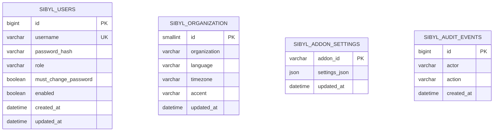

# Sibyl System – Standardinstallation mit MySQL 8

**Version:** Entwicklung `v0.1.0-rc.3` · **Nur vorläufige Tests / Pre-Release.**

## Zweck

Die allgemein nutzbare, firmenneutrale Sibyl-Standardinstallation besteht aus Core, MySQL und einem Benutzer-/Berechtigungsfundament. **MySQL ist die verbindliche Datenbank**, nicht PostgreSQL. Die AD-Integration ist ein optionales Addon und für die Anmeldung an Sibyl nicht erforderlich.

## Ubuntu 24.04 LTS: Einzelserverinstallation

Der Installer `install-sibyl-ubuntu-2404.sh` wird **als Asset des veröffentlichten GitHub-Core-Releases** bereitgestellt. Nur auf einem frischen und eigens dafür vorgesehenen Ubuntu-24.04-Server ausführen. Das Installationsscript vor der Ausführung prüfen.

1. Auf GitHub den veröffentlichten Core-Release `v0.1.0-rc.3` mit dem Installer und SHA256SUMS abrufen und die Dateiintegrität kontrollieren.
2. Als Administrator auf einem **neuen** Ubuntu-24.04-Server `sudo bash install-sibyl-ubuntu-2404.sh` ausführen.
3. Der Installer installiert `mysql-server`, `mysql-client`, Java 21 und notwendige Systemwerkzeuge. Er aktiviert den lokalen MySQL-Dienst und legt die Datenbank `sibyl` in `utf8mb4`/InnoDB mit eigenem Datenbankkonto und zufällig generiertem Passwort an.
4. Das Datenbankpasswort bleibt nur in der root-lesbaren lokalen Datei `/etc/sibyl/core.env` (0600). Es wird weder ins GitHub-Repo, HTML/JavaScript noch in die Startausgabe geschrieben.
5. Das Skript lädt die versionierte **Core-JAR direkt aus dem tatsächlichen GitHub-Release**. Vor der Installation vergleicht es SHA-256 mit dem GitHub-Release-Asset-Digest.
6. Der `sibyl-core`-Systemdienst startet als unprivilegierter `sibyl`-Benutzer. **Flyway** erstellt oder aktualisiert das MySQL-Schema bei jedem Start. Die interne Health-API ist zunächst ausschließlich auf `127.0.0.1:8080` erreichbar.
7. Vor dem Zugriff durch andere Geräte ist ein **HTTPS-Reverse-Proxy mit vertrauenswürdigem Zertifikat** und passenden Netzwerkregeln einzurichten. Der Installer richtet absichtlich keine ungeschützte öffentliche Login-URL ein.

**Updates:** Bestehendes Datenbankpasswort und alle Benutzerdaten bleiben bestehen; neue Flyway-Versionen erweitern das Schema. Vor Upgrades MySQL-Backup + getestetes Restore durchführen. Der Installer ist für eine **lokale Ein-VM-Installation** gebaut und nicht ohne Anpassung für einen separaten DB-Cluster geeignet.

## Erstes Administratorkonto

| Einstellung | Erstinstallation |
|---|---|
| Benutzername | `admin` |
| **Einmaliges** Startpasswort | `friend` |
| Rolle | `ADMIN` |
| Speicherung | MySQL: `sibyl_users` |
| Passwort | BCrypt-Hash, niemals Klartext |
| Passwortwechsel | **Zwingend** bei der ersten Anmeldung |
| Neues Passwort | 12–128 Zeichen, ungleich `friend` |

**Sicherheit:** Weil `friend` öffentlich bekannt ist, muss die neue Installation bis zum ersten Passwortwechsel im **streng begrenzten internen Netzwerk** bleiben. Sibyl blockiert vor dem Passwortwechsel Einstellungen/Addon-Downloads mit HTTP 423. Sobald das Passwort geändert wurde, ist `friend` ungültig. Bereits existierende Benutzerkonten werden durch normale Neustarts/Updates nicht zurückgesetzt.

## Admin-Oberfläche und Einstellungen

Der Adminbereich unter `/admin.html` ist nur über HTTPS zur Anmeldung vorgesehen. Die Core-API speichert Organisation (Name, Sprache, Zeitzone und Farbschema) in MySQL und stellt ausschließlich **nicht sensible** Brandingwerte öffentlich bereit. Addon-spezifische Konfigurationen werden anhand der Addon-ID in `sibyl_addon_settings` gesichert. Passwort-, Token- oder Secret-Felder werden dort explizit verweigert. Ein vollständiger Secret-Store, Mehrbenutzerverwaltung, gruppenbasiertes RBAC und dynamische Addon-Formulare sind **noch geplante Features**, nicht Teil dieses Pre-Releases.

Das Herunterladen eines Addons von GitHub bedeutet aktuell nur `downloaded_not_activated`. Die sichere Addon-Runtime, Aktivierung und AD-Bind-Integration erfordern weitere Umsetzung.

## MySQL-8-Datenbankmodell

Flyway-Migration: `backend/src/main/resources/db/migration/V1__core.sql`

MySQL-spezifisch: `BIGINT AUTO_INCREMENT`, `DATETIME(6)`, native `JSON`, `ON DUPLICATE KEY UPDATE`, `InnoDB`, `utf8mb4_0900_ai_ci`. Keine PostgreSQL-spezifische `JSONB`-/`ON CONFLICT`-Syntax. Der MySQL-8-CI-Dienst testet Flyway-Migrationen sowie Admin-Login, Passwortwechsel und zentrale Settings.

## Betrieb, Backups und Monitoring

- Core: `systemctl status sibyl-core`, `journalctl -u sibyl-core -n 100 --no-pager`
- DB: `systemctl status mysql`, `sudo mysql -e "SHOW DATABASES"`
- Nur mit gültiger MySQL-Berechtigung und verschlüsselter Verbindung von außen zugreifen.
- Vor einem Upgrade ein konsistentes MySQL-Backup erstellen, z. B. als Datenbankadministrator:
  `sudo mysqldump --single-transaction --routines --triggers --events sibyl > sibyl-backup.sql`
  Dateirechte auf 0600 setzen und ein Wiederherstellungsszenario unabhängig testen.

Der Core startet nur, wenn die MySQL-Datenbank erreichbar ist und erforderliche Migrationen erfolgreich waren. Updates dürfen keine unbekannten oder alten DB-Versionen ungefragt zurücksetzen.

## Separate DB-VM auf Cluster 3

Das bestehende, isolierte Entwicklungssetup besteht aus:

| VM | IPv4 | Zweck |
|---|---|---|
| 200 | `172.22.120.240` | HTTPS-Edge / Reverse Proxy |
| 201 | `172.22.120.241` | Sibyl-App (Core, Java 21) |
| 202 | `172.22.120.242` | **MySQL 8** |

Für diese **Mehr-VM-Umgebung** wird MySQL auf VM202 installiert und mit `require_secure_transport=ON` betrieben, auf `172.22.120.242:3306` gebunden und der Datenbankport ausschließlich von `.241` über die Firewall freigegeben. Der DB-Benutzer `sibyl@172.22.120.241` besitzt Datenbankrechte nur auf `sibyl.*`. Die App erhält einen **sicher übermittelten** DB-Zugang ausschließlich über eine root-lesbare Konfigurationsdatei und nutzt `jdbc:mysql://172.22.120.242:3306/sibyl?sslMode=REQUIRED&connectionTimeZone=UTC`. Für eine Produktivumgebung sollte `sslMode=VERIFY_IDENTITY` mit vertrauenswürdiger MySQL-Server-CA verwendet werden.

**Stand der Cluster-3-Migration:** Die MySQL-Datenbank auf `.242` ist eingerichtet, aber die Übergabe der geheimen Datenbankzugangsdaten an `.241` wurde von einer Remote-Sicherheitsprüfung blockiert. Der Core auf `.241` läuft weiterhin auf `v0.1.0-rc.1`, damit der interne Browser nicht unterbrochen wird. Eine MySQL-Core-Umschaltung oder die erste Admin-Anmeldung in MySQL auf Cluster 3 darf erst als erledigt gelten, wenn der sichere Zugriff geklärt, ein veröffentlichtes MySQL-Core-Release vorhanden und die Anwendung mit echten Datenbanktests abgenommen wurde.

**Grenzen:** Die vorhandenen Produktiv- und älteren Testsysteme werden nicht verändert. Ein LAN-gebundener Edge-Server ist keine DMZ.
